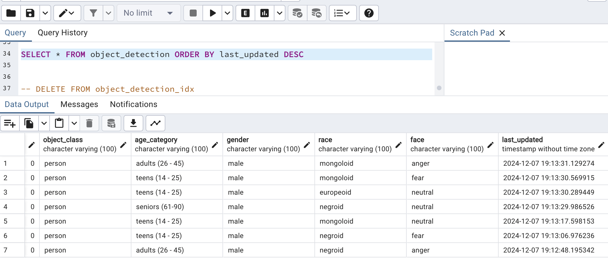
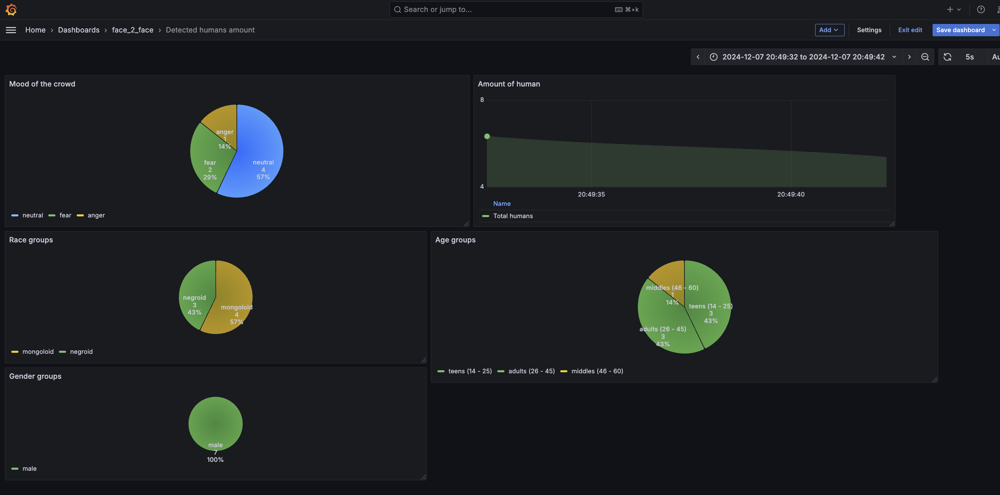
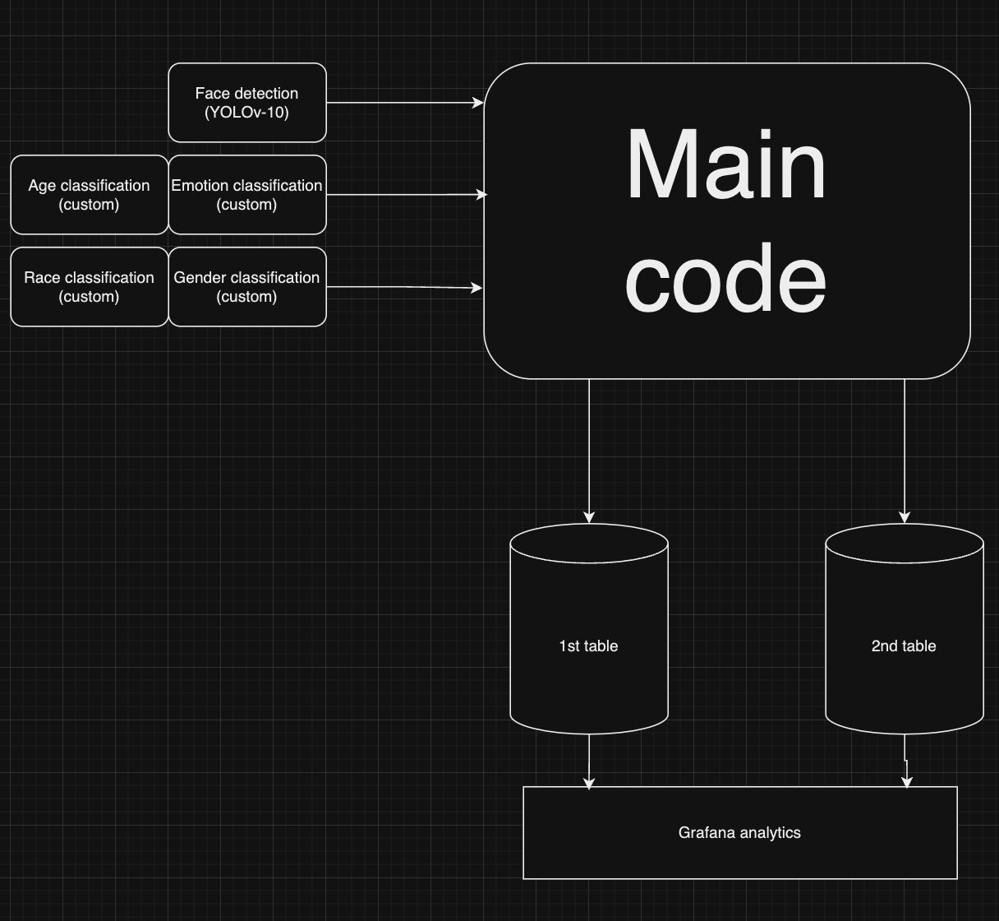
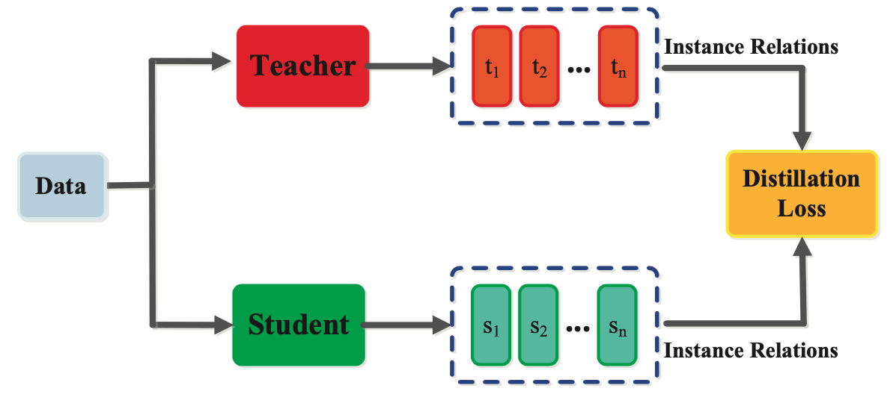
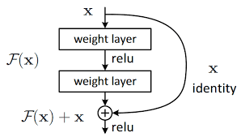

# Face real-time tracker


This project is a real-time human face tracker and classifier, based on the principles of object tracking using the YOLOv10 model (trained specifically for searching human faces), as well as their classification using four custom convolutional neural networks.
The program saves the data of detected faces into a PostgreSQL database. Based on the data obtained, analytics are also performed, the results of which are visualized using the Grafana tool. 
## Principles of the work 
The basis of the model is a custom YOLOv10 model, taken from the repository (https://github.com/akanametov/yolo-face?tab=readme-ov-file), which detects faces on the provided video file. Using the SORT algorithm, the simplest version of object tracking based on the Kalman filter and the Hungarian algorithm, the program tracks all found faces, assigning a specific index to each of them. 

Then, using CV2 technology, the coordinates of each detected face are expanded (to improve classification), creating a zone of interest, which is transmitted to each of four custom neural networks created using the PyTorch library, which determines: 

- Age group 
- Floor 
- Race 
- Emotion

of each person found. This data is written to two tables in a database in PostgreSQL. First of them - 'object_detection' 
contains visually understandable information about detected object for user. This table includes: 


- Unique ID of detected faces
- Tracked object ID (from YOLO) of detected objects - (will be 0 by default).
- Object class - name of detected object 
- Age category - age group of each detected human
- Gender - gender group of each detected human
- Race - racial group of each detected human
- Face - mood of each detected human
- Last updated - time, when object was lastly detected

Second table - 'object_detection_idx' contains same columns, but 
information is stored in numerical form. But also it contains 'status' column
with information is each specific human detected in significant moment or not. 
It is marked with 'detected' / 'not_detected' labels in front of specific time cell. 
This table also contains sum of detected objects for each specific moment in 'total_obj'
column, which is used in Grafana analytics to output amount of detected people in each moment.



When information updates into tables, Grafana tool uses a SQL query to connect to each table and
output graphics with amount of people during different moments of video and 'Pie' diagrams of age, 
racial and gender groups of detected humans and mood of people on the video. Grafana outputs all 
of graphics in a single dashboard, which updates in real-time mode. 

Whole project structure looks like this:


## ML part

Custom convolutional neural network models, which are used to extract information about people on video are realised with different 
technics of accuracy improvement, such as knowledge distillation, transfer learning and skip connection. Knowledge distillation - 
method, which requires usage of two models - teacher (larger one) and a student (smaller one). The idea is 
that smaller model learns same data-patterns that teacher model, but learning process is based not only on 
data, but also on logits of teacher model learning. So as a result, student model uses a common loss to increase it's
accuracy according to next formula:
```
Loss = a * loss_hard + (1 - a) * loss_kl * T^2
```
Where:

- Loss - common loss value received from student and teacher models
- a - alpha value used as weight regularization value (usually 0.5)
- loss_hard - hard (usual) output layer metrics of teacher model - in this case with usual softmax function:
    ```
               e^x_n
    y_hard =  ________
              ∑(e^x_n)
    ``` 
  
  - loss_kl - Kullback-Leibler divergence (KL divergence) - calculated difference (distribution) between 
  soft(!) losses of both models. Sotf loss may be calculated according to next formula:
      ```
                   e^x_n/T
        y_soft =  ________
                  ∑(e^x_n/T)
      ``` 
      where T is temperature coefficient, needed to make both losses softer (it must be more than 1).
  So according to this, KL distribution calculation looks like this: 
      ```
                                            teacher_y_n_soft
        loss_kl = ∑(teacher_y_soft)  * log( _________________ )    
                                            student_y_n_soft
      ``` 

     Where teacher_y_n_soft / student_y_n_soft - soft loss for each metrics in both models output. 
     For example if you've got this output type in teacher model: [0.3, 0.1, 0.2, 0.5] and this output type in student model: 
     [0.2, 0.5, 0.1, 0.2], then last part of KL formula will look like that:
      ```
                   y_soft(0.3)   y_soft(0.1)   y_soft(0.2)  y_soft(0.5)
       ... * log ( ____________, ___________,  ___________, ___________ )
                   y_soft(0.2)   y_soft(0.5)   y_soft(0.1)  y_soft(0.2)
    
    
      ```   
    
In current realisation knowledge distillation method were presented in age classification model
(age_model.ipynb) and emotion classification model (emotion_model.ipynb). As teacher model in both cases I used
'mobilenet_v2' model to increase prediction accuracy as much as possible because difficult to classification data type.
This way knowledge distillation may be realised in PyTorch in train() function:
```
for batch in tqdm(train_dl):
            x = batch[0].to(device)
            y = batch[1].to(device)

            with torch.no_grad():
                teacher_logits = teacher_model(x)

            student_logits = student_model(x)
           
            loss_hard = loss_fn_ce(student_logits, y)
            
            loss_soft = loss_fn_kl(
                F.log_softmax(student_logits / temperature, dim=1),
                F.softmax(teacher_logits / temperature, dim=1)
            )
         
            loss = alpha * loss_hard + (1 - alpha) * loss_soft * (temperature ** 2)

            optimizer.zero_grad()
            loss.backward()
            optimizer.step()
    
```
Another feature, present in each model architecture in my project is skip connection method. It's idea is that 
a signal from one layer is transmitted to the next layer, bypassing one or more intermediate layers:


It also may increase accuracy level, making feature extraction better. In my codes  skip-connection 
method usage is realised in separate blocks:

```
def forward(self, x):
        out = self.conv1(x)
        add_out = self.add_con(x)

        out = F.relu(out)
        out = self.conv2(out)

        out += add_out #(!!!!!)

        out = F.relu(out)

        if self.pool:
            out = self.pool(out)

        return out
```

I experimented with placing skip connection block in different places of final model version and I assume that the best place
for those blocks must be on the first layers of final model version. 

I also must admit, that AdamW optimizer worked quite good during training process so adding a weight decay coefficient
may be a good solution working with image-format data. 

Thanks for your attantion:)

The project may be supplemented in the future.

## Authors:
- Kucher Maks (maxim.kucher2005@gmail.com / Telegramm (for contacts): @aeternummm)


