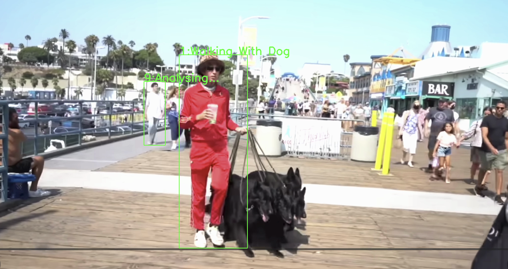

# Human Action Tracking and Recognition



An end-to-end computer vision pipeline for human detection, multi-object tracking, and action recognition in videos.  
The system detects people in video streams, assigns persistent IDs, accumulates short temporal clips per person, and predicts human actions in real time using 3D-CNN and LSTM neural networks.

---

## Overview

**Pipeline:**

- Video

- YOLO (person detection)

- DeepSORT (ID tracking)

- Frame buffer (16 frames per ID)

- Action Recognition Model

- Visualization / Database


The project is designed as a lightweight alternative to heavy 3D CNNs by using **frame-level CNN features combined with temporal modeling**.

---

##  Features

- Human detection using YOLO (Ultralytics)
- Multi-object tracking with DeepSORT
- Action recognition from short video clips (16 frames)
- Asynchronous inference for action classification
- Modular architecture (detector / tracker / action model)
- Optional action logging to a database
- Real-time video visualization

---

##  Models

### Action Recognition

The project supports two models:

#### Teacher Model
- R3D-1* (3D CNN)
- Pretrained on Kinetics-400

#### Student Model (used in inference)
- ResNet34 – frame-level feature extractor
- BiLSTM – temporal modeling
- Temporal Attention – adaptive temporal pooling
- Lightweight and suitable for real-time inference
---

## Usage

### Run Action Tracking on Video

```bash
python main.py \
  --video path/to/video.mp4 \
  --yolo_weights yolo12s.pt \
  --action_model student_model.pt \
  --device cpu \
  --action_device cpu \
  --save_to_db False


