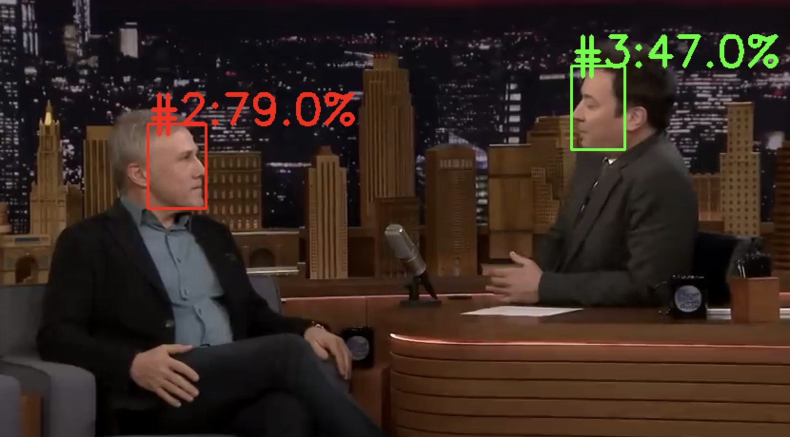

# Face AI identifier



## Idea 

Using a triple neural network trained with metric learning 
this project is able to accept some photos of a person and 
to identify it's face on a video. 

## Triple neural network
This is a type of neural network, which is able to 
find difference between two images (human faces for example) using 
their embeddings. The main idea is of finding difference between two objects
is turning them to vectors and finding distance between those 
vectors with eucledean distance formula. As fewer distance between vectors is, 
as more similarity between images there are. Images could be turned to vectors 
with a usual CNN without fully-connected layer output. 

To train such model we need a dataset, which returns a triple of
images: an anchor (photo 1), a positive label (another recurs of photo 1) and a 
negative label (photo 2). Then, during training proces we pass this triple to a 
triple loss formula:

```
L = max(0, d(A, P) - d(A, N) + a)
```
where:
A - is an anchor image 
P - positive label
N - negative label
a - margin parameter to increase models accuracy

## Functionality 

The idea of project in general is: that model of YOLO with a DeepSort 
will track human faces on the video, while several photos of a specific 
person will be passed through pretrained triplet model to be turned into 
a single embedding. Then, project uses a specific function to calculate 
distance between this common embedding and each detected faces (also turned to embedding)
to identify necessary person on a video. 
